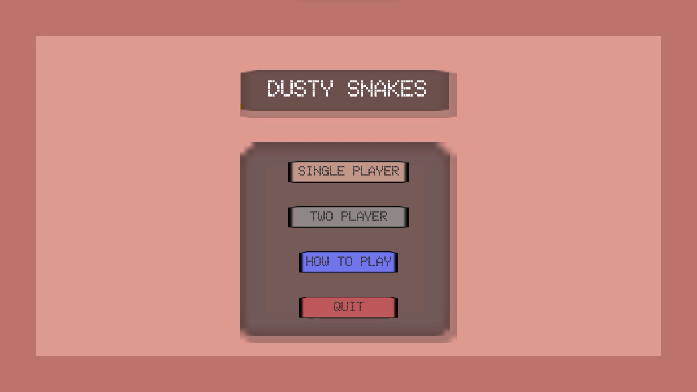
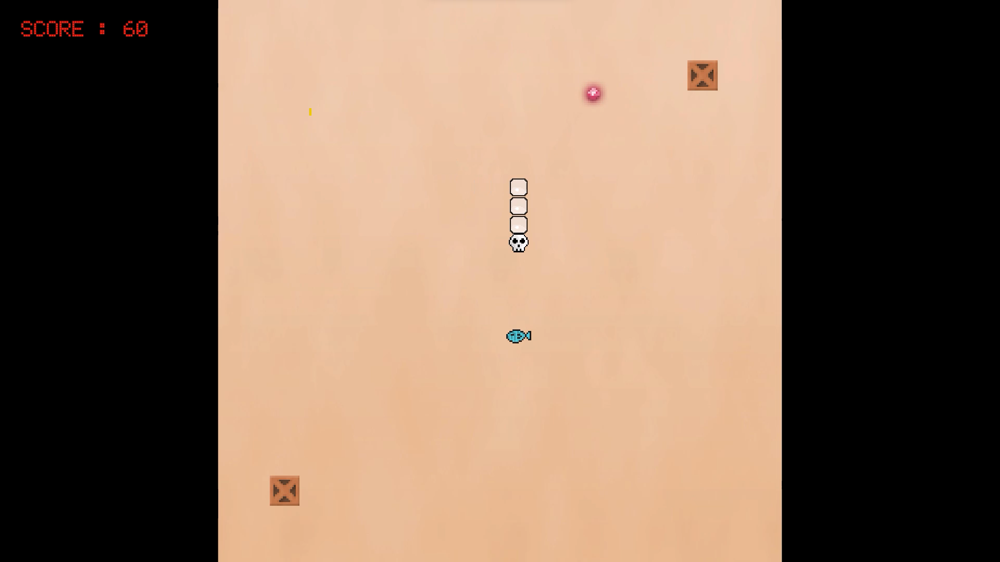
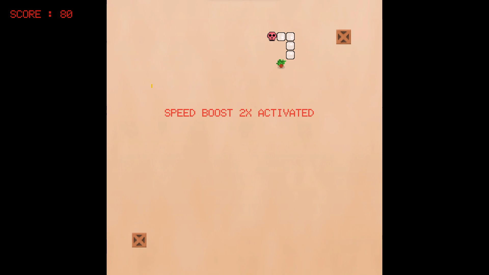
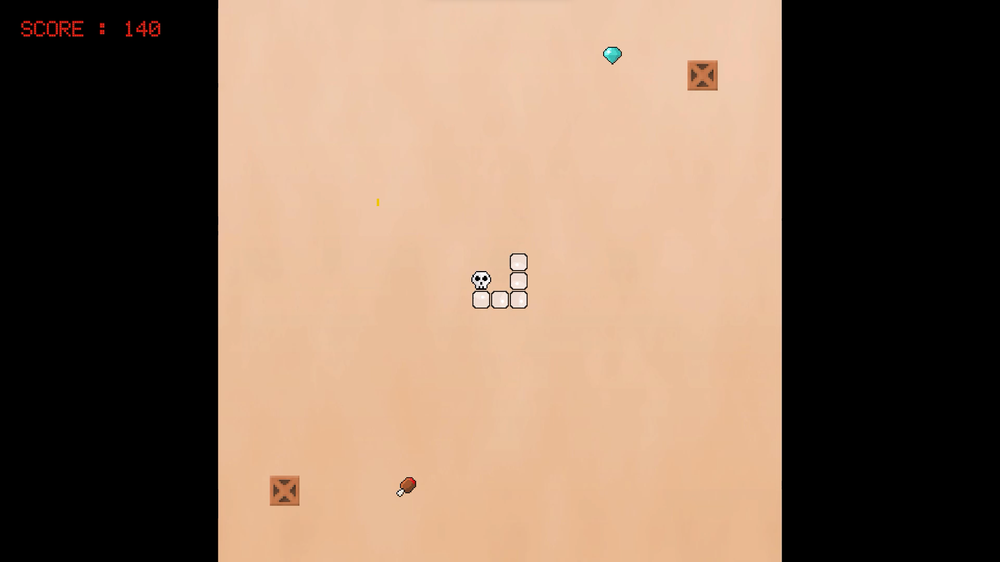
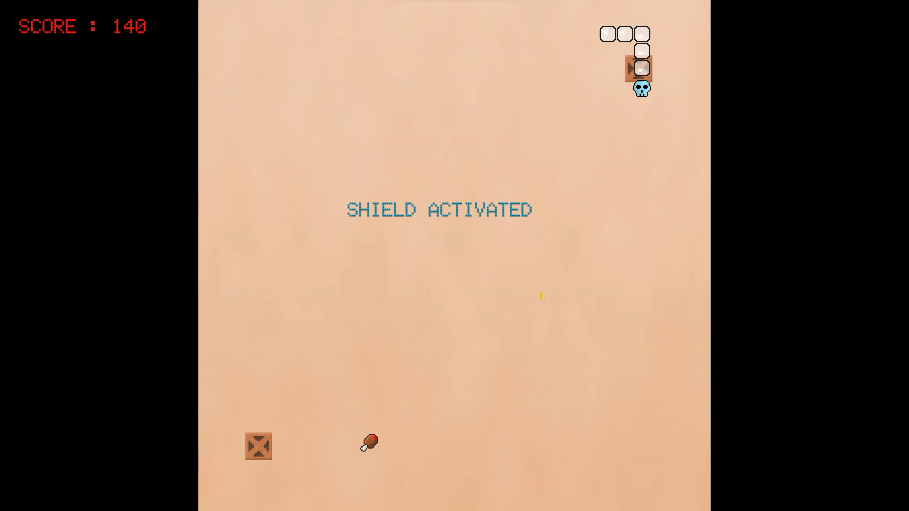
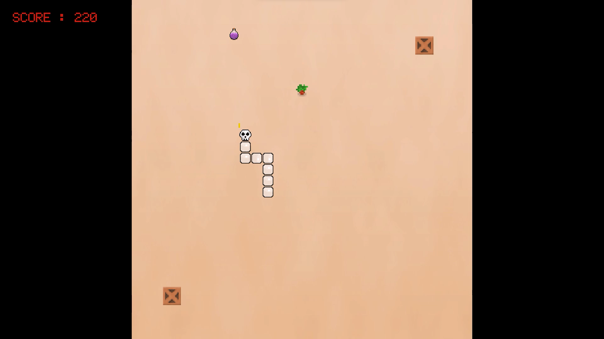
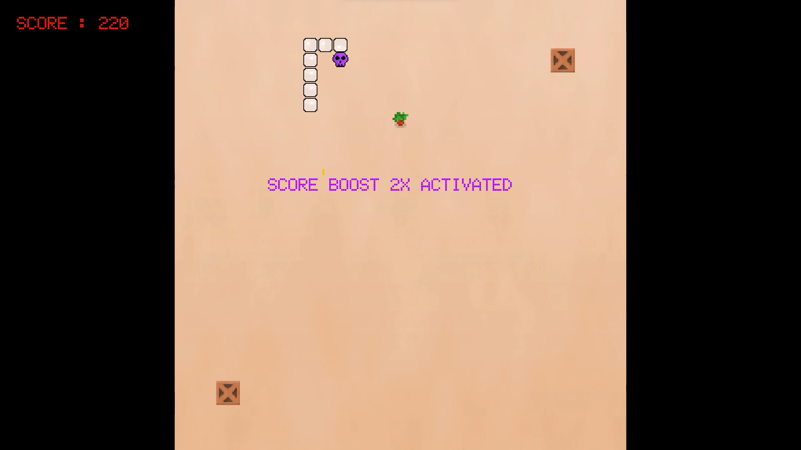

# Co-op-Snake-2D
 
### Introduction

    Dusty Snakes draws inspiration from the classic snake game while introducing additional features like
    cooperative play, a variety of food items, and power-ups. This project places significant emphasis on 
    maintaining code quality and ensuring the game's adaptability for future enhancements.

### Features
    Core Gameplay: 
    - Snake moves in all directions with screen wrapping. 
    - In single player, self-biting ends the game; in co-op, snake collisions result in a loss. 
    - Snake grows/shrinks after food and has power-ups.

    Food: 
    - Two types: Mass Gainer (increases length) and Mass Burner (decreases length). 
    - Food disappears if uneaten and spawns randomly.

    Power-Ups:
    - Three types: Shield (invulnerability), Score Boost (double points), Speed Up. 
    - Power-ups have a 15-seconds cooldown and appear randomly.

    Co-Op Mode: 
    - Dual-player mode for cooperative gameplay.

    User Interface (UI): 
    - Main Menu, Game Over, Scoring, and Power-Up Gain pop-up screens.
    - Pause screen with options to resume and quit the game.
    
### Screenshots
   
   
   
   
   
   
   
   
  
### Code Structure and Game Design

 #### Code Structure
    MVC-S (Model-View-Controller-Service):
        - The codebase is organized using the Model-View-Controller-Service (MVC-S) architectural pattern.
        - This approach maintains a clear separation of concerns:
           - The Model manages data.
           - The View is responsible for UI-related tasks and input handling.
           - The Controller is responsible for updating both the View and Model.
         - Classes for Snake, Food, Powerup, Item, Level, Score have been implemented following the MVC pattern.

    Singletons:
        - Centralized control is ensured through the implementation of Singleton patterns.
        - Essential services such as SnakeService, FoodService, PowerupService, ItemsService, LevelService,
           and ScoreService are designed as Singletons.
           
    Observer Pattern:
        - Employed the observer pattern to decouple classes and facilitate event handling for events such as 
          snake death, food and power-up consumption.
        - This facilitates game over and power-up activation screens and efficient score updates by the ScoreController.
    
    Scriptable Objects:
       - Food Types:
          - Two distinct food types are available:
             - Mass Gainer - Egg, Meat, Fish
             - Mass Burner - Green Strawberry, Pumpkin
       - Powerup Types:
          - Three distinct food types are available:
             - Speed Boost, Score Boost, Shield
       - Snake Scriptable Object:
          - Used for configuring snake-related data.

 #### Performance Optimization:

    - To optimize performance, object pooling is implemented for food, powerups, and snake body parts, 
      which helps manage memory and CPU usage efficiently.
      
#### Input Management:

    - Integrated Unity's new Input System to simplify the mapping of inputs to in-game actions. 
    - Custom input actions like OnMove1() and OnMove2() have been defined for Snake1 and Snake2 Movement.

### Focus

    - Code Quality and Organization.
    - Architecture Design for Flexibility and Scalability.

### Gameplay Demonstration

    For a visual demonstration of the gameplay, watch video on YouTube.

### Play the Game

    To experience the game firsthand, play it directly by following this playable link.
   - https://rahul-pargi.itch.io/dusty-snakes
